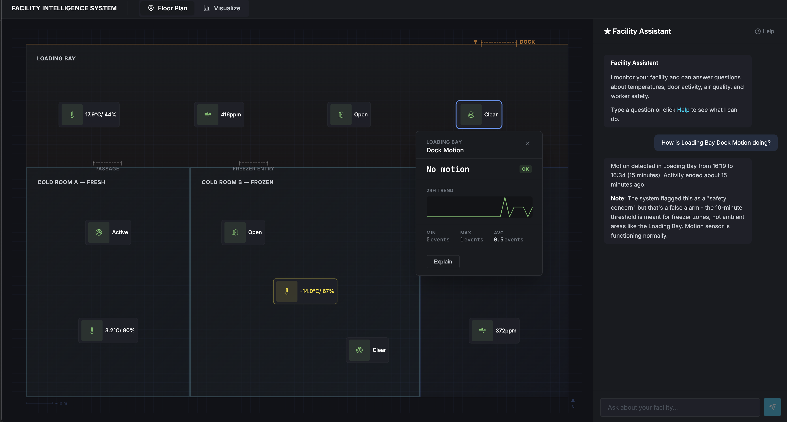
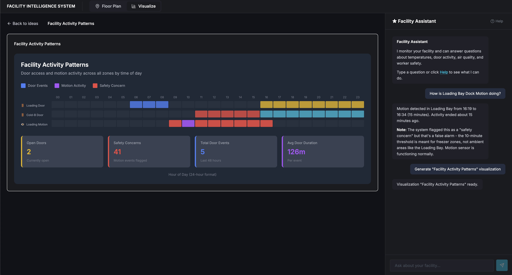

# Facility Intelligence System

AI-powered monitoring dashboard for a fictional cold storage facility. Features interactive floor plans and an AI assistant for investigating sensor anomalies, safety checks, and compliance reporting.

The facility consists of four zones:
- **Loading Bay** — Ambient temperature dock area (15–25°C)
- **Cold Room A** — Fresh goods storage (2–4°C)
- **Cold Room B** — Frozen goods storage (-20 to -16°C)
- **Dry Storage** — Ambient storage for non-perishables (15–20°C)

Each zone is equipped with sensors that record data at 15-minute intervals:
- **Temperature & Humidity** sensors in all zones
- **Air Quality (CO₂)** sensors in Loading Bay and Dry Storage
- **Door sensors** on Loading Bay and Freezer entries
- **Motion sensors** for presence detection and safety monitoring

## Features

### Interactive Floor Plan

The Blueprint view displays the facility as a CSS grid layout with four zone areas. Each zone contains draggable sensor markers showing real-time readings with color-coded status indicators (green/yellow/red).

Clicking a sensor opens an overlay panel with:
- Current reading and status badge
- 24-hour trend sparkline
- Min/max/average statistics
- "Explain" button that sends a contextual query to the AI assistant

Sensor positions are persisted to localStorage, allowing custom arrangement.



### AI-Powered Visualizations

The Visualize view lets users generate custom data visualizations through a two-step AI pipeline:

1. **Select an idea** — Choose from visualization cards (e.g., "Zone Temperature Comparison", "Door Activity Heatmap")
2. **AI generates the chart** — The LangGraph agent:
   - Gathers relevant data by calling tools (sensor readings, door events, baselines)
   - Generates JSX code using Claude that renders the visualization
3. **Live rendering** — The generated code is executed client-side using [react-live](https://github.com/FormidableLabs/react-live) with access to [Recharts](https://recharts.org) components

This approach allows the AI to create arbitrary visualizations tailored to the data, rather than being limited to pre-built chart types.



### Chat Assistant

The right panel provides a conversational interface to the facility data. Users can ask questions like:
- "Why is Cold Room B showing a warning?"
- "Were there any safety concerns in the freezer today?"
- "Show me door activity for the loading bay"

The assistant uses tools to query the database and provides answers with relevant context.

## Prerequisites

- Node.js 20+
- Python 3.11+
- [uv](https://docs.astral.sh/uv/) (recommended) or pip

## Setup

1. **Clone and configure environment**

   ```bash
   git clone <repo-url>
   cd facility-intelligence-system
   cp .env.example .env
   # Edit .env and add your ANTHROPIC_API_KEY
   ```

2. **Install and run backend**

   ```bash
   uv sync
   cd backend
   uvicorn app.main:app --reload --port 8000
   ```

3. **Install and run frontend** (new terminal)

   ```bash
   cd frontend
   npm install
   npm run dev
   ```

4. **Open the app**
   - http://localhost:5173

## Database

The repository includes `data/facility.db` with pre-generated sensor data (~48 hours of readings). To regenerate the database with fresh data:

```bash
cd backend
python scripts/setup_database.py
```

This runs the scripts in `backend/scripts/` to initialize the schema, seed zones/sensors, and generate simulated readings.

## Environment Variables

Only `ANTHROPIC_API_KEY` is required. See `.env.example` for optional settings.

To enable LangSmith tracing, set:
```
LANGSMITH_TRACING=true
LANGSMITH_ENDPOINT=https://api.smith.langchain.com
LANGSMITH_API_KEY=your-key
LANGSMITH_PROJECT=your-project
```

## Development

| Command | Location | Description |
|---------|----------|-------------|
| `npm run dev` | frontend/ | Start dev server |
| `npm run test` | frontend/ | Run tests |
| `npm run lint` | frontend/ | Lint code |
| `uvicorn app.main:app --reload` | backend/ | Start API server |
| `pytest` | backend/ | Run tests |
| `ruff check .` | backend/ | Lint code |

## Architecture

### LangGraph Agent

The AI assistant uses [LangGraph](https://langchain-ai.github.io/langgraph/) to orchestrate multi-step reasoning with tools. The agent is built as a `StateGraph` with three workflows:

```
                    ┌─────────────┐
                    │   Router    │
                    └──────┬──────┘
           ┌───────────────┼───────────────┐
           ▼               ▼               ▼
    ┌─────────────┐ ┌─────────────┐ ┌─────────────┐
    │  Chat Node  │ │  Ideation   │ │  Generate   │
    │   (ReAct)   │ │    Node     │ │    Node     │
    └─────────────┘ └─────────────┘ └─────────────┘
```

- **Chat Node**: ReAct agent for natural conversation. Uses tools to query sensor readings, door events, presence data, and baselines. Answers questions about facility status, anomalies, and safety.

- **Ideation Node**: Analyzes conversation context and suggests relevant visualizations (e.g., "24-hour temperature timeline", "door activity heatmap").

- **Generate Node**: Two-step visualization creation:
  1. Data gathering agent reasons about what data is needed and calls appropriate tools
  2. Code generation produces JSX for rendering dynamic charts

The graph uses a `MemorySaver` checkpointer to persist conversation history across requests, enabling multi-turn conversations with context.

### Data Flow

```
Frontend ──SSE──▶ FastAPI ──▶ LangGraph Agent ──▶ Tools ──▶ SQLite
                     │                                        │
                     ◀────────── Streaming Response ◀─────────┘
```

Responses stream back via Server-Sent Events (SSE) for real-time UI updates during tool execution and text generation.

## Tech Stack

- **Frontend**: React, TypeScript, Vite, Tailwind CSS
- **Backend**: FastAPI, SQLAlchemy, LangGraph
- **AI**: Claude (Anthropic)
